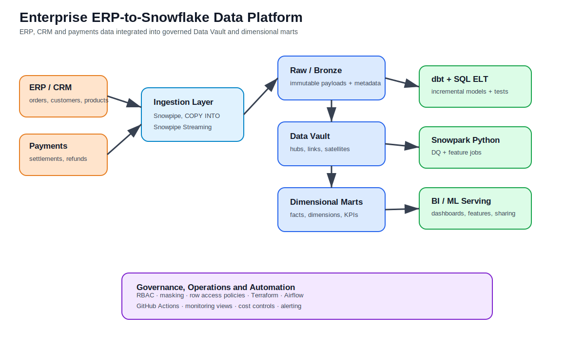
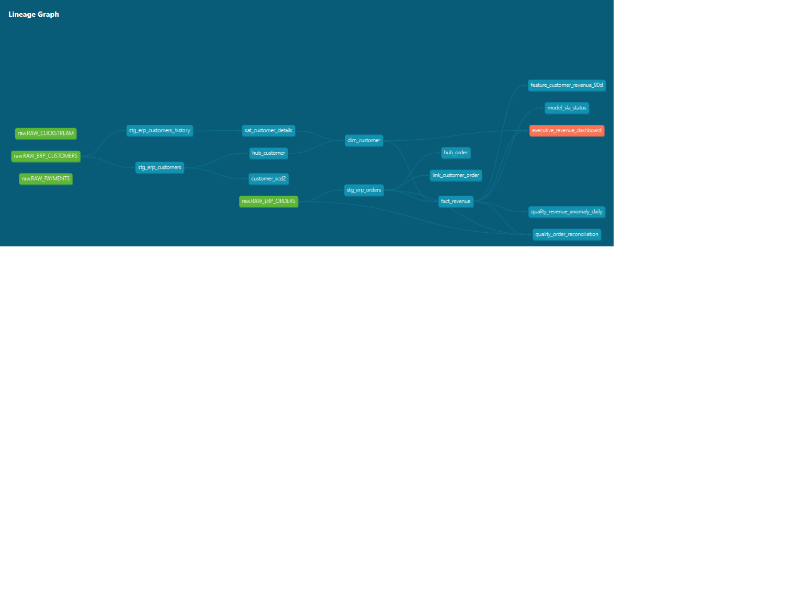
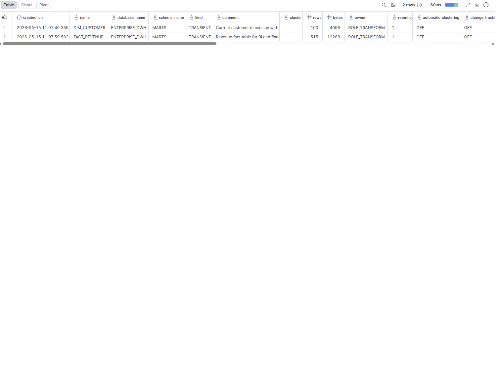

# Enterprise ERP-to-Snowflake Data Platform

**Author:** Hristina Todorova

Production-oriented reference implementation.
Not intended as a turnkey SaaS deployment.

**Production-oriented senior data engineering reference implementation** · Snowflake · dbt · Python · Terraform · Airflow · Data Vault · Dimensional Modeling


---

# Enterprise Architecture Preview



---

# Table of Contents

* [Quick Recruiter Summary](#quick-recruiter-summary)
* [Architecture Overview](#architecture-overview)
* [Technology Stack](#technology-stack)
* [Business Case](#business-case)
* [Engineering Goals](#engineering-goals)
* [Production Validation](#production-validation)
* [Airflow Orchestration](#airflow-orchestration)
* [Repository Structure](#repository-structure)
* [Environment Configuration](#environment-configuration)
* [Getting Started](#getting-started)
* [Local Validation](#local-validation)
* [Security & Governance](#security--governance)
* [CI/CD](#cicd)
* [Why This Repository Exists](#why-this-repository-exists)
* [What Makes This Repository Different](#what-makes-this-repository-different)
* [Platform Scope](#platform-scope)
* [Repository Design Philosophy](#repository-design-philosophy)
* [Known Limitations](#known-limitations)

---

# Quick Recruiter Summary

This repository is a senior-level Snowflake and Data Engineering reference implementation designed to demonstrate modern enterprise analytics platform patterns commonly used in large-scale organizations.

The platform integrates ERP, CRM and e-commerce data into Snowflake using SQL-based ELT, dbt, Data Vault modeling and governed dimensional marts.

The repository intentionally separates:

* runnable local validation workflows
* core platform implementation patterns
* optional production-oriented extensions

This allows the project to remain fully reviewable as a public GitHub repository while still demonstrating how the architecture would scale in a real enterprise environment.

The implementation demonstrates practical experience with:

* Snowflake platform architecture and workload isolation
* SQL-based ELT with Snowpipe, Streams, Tasks and CDC processing
* Data Vault 2.0 raw vault modeling and dimensional marts
* dbt staging, vault, mart, quality and observability layers
* Snowpark Python for data quality and feature engineering
* Terraform Infrastructure as Code for warehouses, roles and governance
* Airflow orchestration with retries, branching, SLA checks and quality gates
* RBAC, masking policies and row access governance
* Monitoring for freshness, task failures and warehouse usage
* Secret scanning, key-pair authentication and least-privilege access design

Best fit: **Senior Data Engineer**, **Snowflake Data Engineer**, **Analytics Engineer**, **Data Platform Engineer**

---

# Architecture Overview

The platform follows a layered enterprise analytics architecture designed for scalability, governance and modular transformation workflows.

## Data Flow

1. ERP, CRM and e-commerce systems land data into Snowflake RAW layers
2. Incremental ELT pipelines process changes using Streams and Tasks
3. dbt staging models standardize and validate source data
4. Data Vault 2.0 models preserve historical lineage and auditability
5. Dimensional marts expose analytics-ready business entities
6. Snowpark Python workloads support data quality and advanced transformations
7. Airflow orchestrates scheduling, retries, SLA validation and dependency management
8. Terraform provisions Snowflake infrastructure, RBAC and governance controls

The architecture emphasizes:

* auditability
* modularity
* CI-safe deployments
* workload isolation
* governed analytics engineering
* enterprise operational patterns

---

# Technology Stack

| Area                   | Technologies                                |
| ---------------------- | ------------------------------------------- |
| Cloud Data Platform    | Snowflake                                   |
| Transformation         | dbt                                         |
| Programming            | Python 3.11                                 |
| Orchestration          | Apache Airflow                              |
| Infrastructure as Code | Terraform                                   |
| Data Modeling          | Data Vault 2.0, Star Schema                 |
| Data Quality           | pytest, SQLFluff                            |
| CI/CD                  | GitHub Actions                              |
| Governance             | RBAC, masking policies, row access policies |
| Monitoring             | Snowflake Account Usage Views               |

---

# Business Case

A Swiss enterprise is modernizing an ERP-centric analytics landscape. Data currently exists across ERP, CRM, payment systems and web event platforms.

The business requires:

* trusted revenue reporting
* customer profitability analytics
* auditability and lineage
* scalable batch and near-real-time processing
* governed self-service analytics
* controlled access to sensitive financial and customer data
* enterprise-grade observability and operational monitoring

The organization currently faces several common enterprise data challenges:

* fragmented operational systems
* duplicated reporting logic
* inconsistent KPIs across departments
* manual reconciliation processes
* poor historical traceability
* limited governance controls
* increasing infrastructure and reporting costs

This repository implements a reference architecture for addressing those challenges using Snowflake, dbt, Data Vault and governed analytics engineering patterns.

---

# Engineering Goals

The repository prioritizes:

* maintainability
* modularity
* auditability
* realistic enterprise architecture
* operational clarity
* governed analytics engineering

---

# Production Validation

The repository includes validated local execution workflows for:

* dbt build execution
* Snowflake connectivity
* local data quality validation
* pytest validation
* CI workflow execution
* orchestration smoke testing

## dbt Build Validation


## dbt Lineage



## Snowflake Deployment Validation



---

# Airflow Orchestration

The platform includes production-oriented orchestration patterns using Apache Airflow:

* DAG dependency management
* retry handling
* SLA monitoring
* branching logic
* quality gate execution
* operational alerting patterns


---

# Repository Structure

```text
enterprise_snowflake_platform/
├── airflow/                # Airflow DAG orchestration
├── dbt/                    # dbt models and transformations
├── terraform/              # Infrastructure as Code
├── snowflake/              # Snowflake SQL objects
├── security/               # RBAC and governance policies
├── monitoring/             # Observability and monitoring SQL
├── tests/                  # Local validation and pytest suites
├── docs/                   # Architecture diagrams and screenshots
└── synthetic_data/         # Local development datasets
```

---

# Environment Configuration

Create a local `.env` file based on `.env.example`.

Example:

```env
SNOWFLAKE_ACCOUNT=
SNOWFLAKE_USER=
SNOWFLAKE_PASSWORD=
SNOWFLAKE_ROLE=ROLE_TRANSFORM
SNOWFLAKE_WAREHOUSE=WH_TRANSFORM_M
SNOWFLAKE_DATABASE=ENTERPRISE_DWH
SNOWFLAKE_SCHEMA=MARTS
```

The `.env` file is intentionally excluded from version control.

---

# Getting Started

## 1. Clone Repository

```bash
git clone https://github.com/hktodorova/enterprise_snowflake_platform.git
cd enterprise_snowflake_platform
```

## 2. Create Environment File

Create a local `.env` file using `.env.example`.

## 3. Install Dependencies

```bash
pip install -r requirements.txt
```

## 4. Validate dbt Connectivity

```bash
dbt debug --target ci
```

## 5. Execute Local Validation

```bash
pytest -q
python smoke_test_project.py
```

## 6. Execute dbt Build

```bash
dbt build --target ci
```

---

# Local Validation

Run local validation workflows:

```bash
pytest -q
python smoke_test_project.py
dbt debug --target ci
dbt build --target ci
```

The repository includes lightweight local validation patterns to allow partial execution without requiring enterprise infrastructure.

---

# Security & Governance

The platform demonstrates enterprise governance patterns including:

* RBAC role separation
* masking policies
* row access policies
* least-privilege access
* workload isolation
* environment separation
* credential externalization
* CI-safe secret handling

---

# CI/CD

GitHub Actions workflows validate:

* pytest execution
* SQL linting
* dbt parsing
* repository smoke tests
* dependency validation

The CI pipeline is intentionally designed to remain lightweight and executable in public GitHub environments.

---

# Why This Repository Exists

This repository was created to demonstrate how modern enterprise analytics platforms are designed beyond tutorial-level pipelines.

The focus is intentionally placed on:

* platform architecture
* governance
* auditability
* operational scalability
* CI-safe engineering workflows
* modular infrastructure patterns
* production-oriented analytics engineering

rather than building a minimal demo pipeline.

---

# What Makes This Repository Different

Unlike tutorial-style data engineering repositories, this implementation focuses heavily on:

* governance and RBAC
* workload isolation
* operational scalability
* CI-safe engineering
* auditability and lineage
* enterprise observability
* modular infrastructure patterns
* realistic warehouse organization
* production-oriented analytics engineering practices

The repository intentionally prioritizes architecture realism over simplified demo pipelines.

---

# Platform Scope

## Core Platform

The primary implementation includes:

* Snowflake ingestion and storage layers
* Raw Vault modeling
* Dimensional marts
* dbt transformation framework
* governance and observability
* local validation and CI checks
* data quality validation patterns
* incremental ELT processing
* enterprise-style schema organization

The core platform is intentionally designed to demonstrate realistic enterprise data platform structure rather than simplified tutorial-style pipelines.

## Optional Production Extensions

The repository also contains modular production-style examples for:

* Airflow orchestration
* Terraform infrastructure provisioning
* advanced warehouse optimization
* monitoring and operational runbooks
* governance promotion workflows
* cost optimization strategies
* incident-response documentation
* credential-rotation procedures

These components intentionally require organization-specific configuration, credentials and infrastructure.

---

# Repository Design Philosophy

This repository intentionally separates:

* executable local validation workflows
* enterprise architectural patterns
* production-oriented infrastructure examples
* governance implementation examples
* operational monitoring patterns

The goal is to demonstrate realistic enterprise analytics engineering approaches while keeping the repository fully reviewable and portable as a public GitHub project.

Several modules are intentionally structured as reference implementations rather than organization-specific production deployments.

---

# Known Limitations

This repository is a production-oriented reference implementation and not a turnkey SaaS deployment.

Certain infrastructure modules intentionally require organization-specific:

* credentials
* networking
* Snowflake account configuration
* secrets management
* cloud infrastructure integration
* orchestration environments

Examples are designed to demonstrate architecture, engineering practices and governance patterns rather than serve as plug-and-play production infrastructure.
