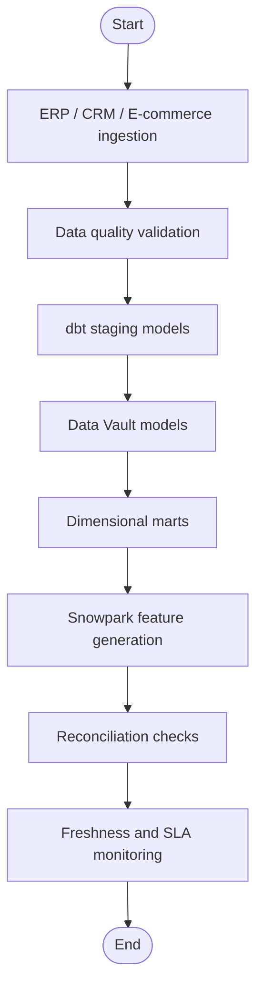

# Airflow Orchestration Flow

The diagram below shows the orchestration flow for ingestion, validation, dbt transformations, feature generation and observability checks.

```mermaid
graph TD

START([Start])

INGEST[ERP / CRM / E-commerce ingestion]
VALIDATE[Data quality validation]
STAGE[dbt staging models]
VAULT[Data Vault models]
MARTS[Dimensional marts]
FEATURES[Snowpark feature generation]
QUALITY[Reconciliation checks]
OBSERVE[Freshness and SLA monitoring]
ENDNODE([End])

START --> INGEST
INGEST --> VALIDATE
VALIDATE --> STAGE
STAGE --> VAULT
VAULT --> MARTS
MARTS --> FEATURES
FEATURES --> QUALITY
QUALITY --> OBSERVE
OBSERVE --> ENDNODE
```