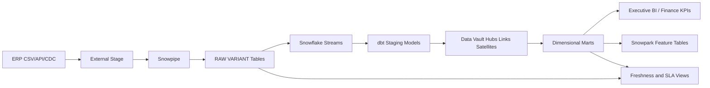
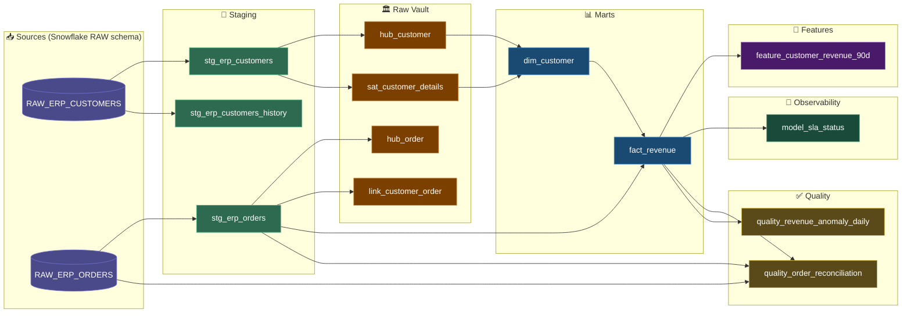

# Data Lineage

## High-Level Architecture

## dbt Model-Level Lineage

The platform separates ingestion, integration, serving and monitoring so each layer has a clear owner, SLA and rollback path.
